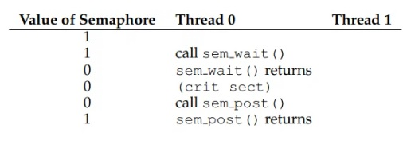
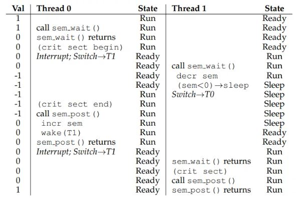
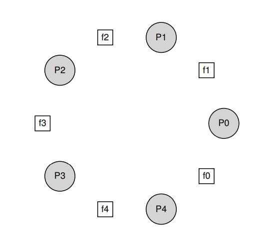

# Ostep глава 31. Semaphores

Как мы теперь знаем, для решения широкого спектра актуальных и интересных проблем параллелизма нужны как блокировки, 
так и переменные условия. Одним из первых людей, осознавших это много лет назад, был **Эдсгер Дейкстра** 
(хотя точную историю трудно узнать [GR92]), известный, среди прочего, своим знаменитым алгоритмом “кратчайших путей” 
в теории графов [D59], ранней полемикой по структурированному программированию под названием 
“Утверждения Goto считаются вредными”. [D68a] (какое замечательное название!), и, в случае, который мы будем изучать 
здесь, введение примитива синхронизации, называемого **семафором** [D68b, D72]. Действительно, Дейкстра и его 
коллеги изобрели семафор как единый примитив для всех вещей, связанных с синхронизацией; как вы увидите, семафоры 
можно использовать как в качестве блокировок, так и в качестве переменных условий.

> ПРОБЛЕМА: КАК ИСПОЛЬЗОВАТЬ СЕМАФОРЫ
> 
> Как мы можем использовать семафоры вместо блокировок и переменных условий? Каково определение семафора? 
> Что такое двоичный семафор? Просто ли построить семафор из блокировок и переменных условий? А создать блокировку 
> и переменную условия из семафора?

## 31.1 Семафоры: Определение

Семафор - объект с целочисленным значением, которым мы можем манипулировать с помощью двух функций; в стандарте 
POSIX, это функции **sem_wait()** и **sem_post()*** Т.к. начальное значение семафора определяет его поведение, до вызова 
любой другой функции для управления семафором, мы должны инициализировать его каким-то значением, так как это 
делает код на рисунке 31.1

>Исторически так сложилось, что функция sem_wait была названа Дейкстрой P(), а sem_post была названа V(). 
> Эти сокращённые формы происходят от голландских слов; что интересно, слова от которых сокращения происходили 
> изначально сейчас изменились. Первоначально P() пришло от слова "passering" (to pass) и V() от "vrijgave" 
> (release); позже, Дейкстра написал что P() произошло от "prolaag", сокращение от "probeer" (голландское try) и 
> "verlaag" ("decrease"), и V() из "verhoog", что означает "increase". Иногда, люди называют их down и up. 
> Используйте голландские варианты для того чтобы удивить своих друзей или смутить их. 
> Смотрите https://news.ycombinator.com/ item?id=8761539 для большей информации.

    1 #include <semaphore.h>
    2 sem_t s;
    3 sem_init(&s, 0, 1)

Рисунок 31.1 - Инициализация семафора

На рисунке 31.1 мы определили семафор S и инициализировали его значением 1 передав 1 в качестве третьего аргумента.
Второй аргумент переданный в **sem_init()** будет установлен в 0 во всех примерах которые мы увидим; это указание на 
доступность семафора из разных потоков одного и того же процесса. Посмотрите мануал для того чтобы узнать о других 
способах использования семафора 
(например как они могут быть использованы для синхронизации доступа между несколькими процессами) что требует другого 
аргумента для второго параметра.

После того как семафор инициализирован, мы можем вызвать одну из двух функций для взаимодействия с ним, **sem_wait()** или 
**sem_post()**. Поведение этих двух функций изображено на рисунке 31.2

На данный момент мы не станем заниматься реализацией этих процедур, т. к. это требует некоторой осторожности; при 
наличии множества потоков вызывающих **sem_wait()** и **sem_post()**, очевидно необходимо управлять этими критическими секциями.
Сейчас мы сфокусируемся на том как *использовать* эти примитивы; позже мы обсудим то как они устроены.

Теперь мы должны обсудить несколько важных аспектов интерфейсов. Во-первых можно заметить то что **sem_wait()** либо сразу 
вернёт значение (потому что значение семафора было => 1 когда мы вызвали **sem_wait()**), или это заставит вызывающего 
приостановить выполнение в ожидании последующего сообщения. Естественно, множество потоков может вызывать **sem_wait()** и 
таким образом, все будут стоять в очереди, ожидая, когда их разбудят. 

Во-вторых мы можем увидеть, что **sem_post()** не ждёт каких-то конкретных условий как это делает **sem_wait()**. Вместо этого 
он просто увеличивает значение семафора и затем, если есть поток ожидающий пробуждения, пробуждает один из них. 

В-третьих, значение семафора, когда оно негативное, равно количеству ожидающих потоков [D68b]. Хотя значение обычно не 
видно пользователям семафоров, этот инвариант стоит знать и, возможно, поможет вам вспомнить, как функционирует семафор.

    1 int sem_wait(sem_t *s){
    2    decrement the value of semaphore s by one
    3    wait if value of semaphore s is negative
    4 }
    5 
    6 int sem_post(sem_t *s){
    7    increment the value of semaphore s by one
    8    if there are one or more threads waiting, wake one
    9 }

Рисунок 31.2 - Семафор: Определение wait и post

    1 sem_t m;
    2 sem_init(&m, 0, X); // initialize to X; what should X be?
    3
    4 sem_wait(&m);
    5 // critical section here
    6 sem_post(&m);

Рисунок 31.3 - Бинарный семафор. (Да, это блокировка)

Не беспокойтесь (пока) о предполагаемых вами race conditions при использовании семафора; предположим что действия 
которые они делают совершаются атомарно. Мы скоро используем блокировку и переменные условия для того чтобы показать как 
обеспечить атомарность.

## 31.2 Бинарные семафоры. (Блокировки)

Мы готовы использовать семафор. Наш первый опыт будет проходить в знакомой обстановке: использование семафора в качестве 
блокировки. На рисунке 31.3 изображён соответствующий код; в нём вы увидите, что мы оборачиваем критическую секцию 
вызовами sem_wait() / sem_post(). Критическим условием для работоспособности кода является инициализация семафора 
значением Х. Чем должен быть Х?

>... попробуйте подумать об этом до того как продолжите чтение ...

Изучив приведённое выше определение подпрограмм sem_wait() и sem_post(), мы видим, что начальное значение должно быть равно 1.

Чтобы точно разобраться в этом вопросе, давайте представим себе ситуацию с двумя потоками. Первый поток (Thread 0) 
вызывает sem_wait(); это уменьшит счётчик семафора приводя его к нулю. Затем, он будет ожидать только если значение не 
больше нуля или равно нулю. Т.к. значение равно нулю, sem_wait() просто выполнит return и вызывающий поток продолжит 
выполнение; Thread 0 теперь может войти в критическую секцию. Если никакой другой поток не попробует захватить 
блокировку пока Thread 0 в критической секции, когда он вызовет sem_post(), значение семафора восстановится к единице 
(и не разбудит ожидающий поток потому что никто не находится в очереди на пробуждение). Рисунок 31.4 показывает 
трассировку этого сценария. 

Более интересный сценарий возникает когда Thread 0 удерживает блокировку (т.е. он вызвал sem_wait() но ещё не вызвал 
sem_post()), и другой поток Thread 1 пытается войти в критическую секцию вызывая sem_wait(). В таком случае, Thread 1 
уменьшит счётчик семафора до -1, и 

Рис. 31.4 - Трассировка потока выполнения: Единственный поток использует семафор

Рис. 31.5 - Трассировка потока выполнения: два потока используют семафор

перейдёт в режим ожидания (переводит себя в спящий режим и отдаёт ресурсы процессора). Когда Thread 0 запустится снова, 
он вызовет sem_post() что увеличит значение семафора обратно к 0 и разбудит спящий поток Thread 1, который сможет 
захватить блокировку для себя. Когда Thread 1 закончит работу с критической секцией, он вызовет sem_post() что увеличит 
значение семафора и вернёт его к 1.

Рисунок 31.5 изображает трассировку этого примера. В дополнение к действиям потока, рисунок показывает состояние 
планировщика для каждого потока: Run (поток выполняется), Ready (готов к выполнению но не выполняется), Sleep 
(поток заблокирован). Имейте ввиду что Thread 1 уходит в состояние Sleep когда пытается захватить уже захваченную 
блокировку; только когда Thread 0 запустится снова, Thread 1 будет пробуждён и потенциально может быть запущен снова.

Если вы хотите рассмотреть ситуацию на собственном примере, попробуйте сценарий когда несколько потоков попадают в 
очередь в ожидании освобождения блокировки. Каким будет значение семафора после трассировки примера?

Таким образом мы можем использовать семафоры как блокировки. Т.к. блокировки имеют только два состояния (захвачена и не 
захвачена), мы иногда называем семафор используемый в качестве блокировки **бинарным семафором**. Учтите что если используете 
семафор в таком бинарном варианте, можно реализовать его в более простом варианте чем представленный в примере 
адаптированный семафор общего назначения.

## 31.3 Семафоры в задачах выполнения по порядку 

Семафоры полезны в задачах упорядочивания событий в конкурентных программах. Например, возможна ситуация, когда 
необходимо уведомить какой-нибудь поток о том, что список с которым он работает перестал быть пустым, поэтому поток 
может удалить данные из такого списка. В рассмотренном сценарии мы ждём когда поток ожидает наступление события, другой 
поток заставляет это ожидаемое событие произойти и сигнализирует о том, что событие произошло таким образом пробуждая 
ожидающий поток. Таким образом мы используем семафор как упорядочивающий примитив (**ordering primitive**) (подобно тому как 
мы использовали переменные условий ранее).

Простой пример заключается в следующем. Представьте ситуацию в которой поток создаёт дочерний поток и ждёт завершения 
его работы (рис. 31.6)

    1 sem_t s;
    2 
    3 void *child(void *arg){
    4     printf("child\n");
    5     sem_post(&s);  // signal here: child is done
    6     return NULL;
    7 }
    8
    9 int main(int argc, char *argv[]){
    10    sem_init(&s, 0, X);  // what should X be?
    11    printf("parent: begin\n");
    12    pthread_t c;
    13    Pthread_create(&c, NULL, child, NULL);
    14    sem_wait(&s);  // wait here for child
    15    printf("parent: end\n");
    16    return 0;
    17 }

Рисунок 31.6 - Родитель ждёт своего ребёнка

Когда эта программа запустится, мы хотим увидеть следующее 

    parent: begin
    child
    parent: end

Далее вопрос будет заключаться в том как использовать семафор для достижения такого эффекта; как выясняется, ответ 
относительно легко понять. Как вы можете увидеть в коде, родитель просто вызывает sem_wait() а дочерний поток sem_post() 
таким образом ожидая сигнала о том, что дочерний поток завершил выполнение. Тем не менее это рождает вопрос: каким должно 
быть начальное значение семафора?

*(Опять подумайте об этом прежде чем продолжить читать)*

Ответ, естественно, заключается в том, что начальное значение семафора должно быть равно нулю. Здесь два случая которые 
нужно рассмотреть. В первом случае, предположим, что родительский поток создаёт дочерний поток но дочерний поток ещё не 
в работе (сидит себе в очереди в режиме ожидания и не выполняется). В таком случае (рис. 31.7) 

")
")

родитель вызовет sem_wait() до того как дочерний поток вызовет sem_post(); мы бы хотели чтобы родительский поток 
дождался окончания выполнения дочернего потока. Единственный способ которым это произойдёт это если значение семафора 
будет не больше 0; следовательно 0 это правильное начальное значение. Родительский поток запускается, уменьшает значение 
семафора до -1 и уходит в режим ожидания (засыпает). Когда дочерний поток наконец-то выполнится, он вызовет sem_post(), 
увеличит значение семафора до 0 и разбудит родительский поток, который завершит вызов sem_wait() и завершит программу.

Второй случай (рис. 31.8) происходит когда дочерний поток завершает выполнение до того как родительский поток получает 
шанс вызвать sem_wait(). В данном случае, родительский поток сначала вызовет sem_post() и увеличит значение семафора с 
0 до 1. Когда родительский поток продолжит выполнение, он вызовет sem_wait() и обнаружит что значение семафора равно 1; 
родительский поток уменьшит значение до 0 и вернётся из вызова sem_wait() без ожидания, также достигнув желаемого эффекта. 

## 31.4 The Producer / Consumer проблема Bounded Buffer

Следующая проблема, с которой мы столкнемся в этой главе, известна как проблема **producer/consumer** также известная как 
проблема **bounded buffer** [D72]. Эта проблема подробно описана в предыдущей главе, посвященной переменным условий; 
подробности смотрите там.

>ДОП: УСТАНОВКА ЗНАЧЕНИЯ СЕМАФОРА
> 
> Теперь мы рассмотрели два примера инициализации семафора. В первом случае мы устанавливаем значение в 1, чтобы 
> использовать семафор в качестве блокировки; во втором - в 0, чтобы использовать семафор для упорядочивания. Итак, 
> каково общее правило для инициализации семафора? Один простой способ подумать об этом, благодаря Perry Kivolowitz, - 
> это оценить количество ресурсов, которые вы готовы отдать сразу после инициализации. В случае с блокировкой значение 
> было равно 1, потому что необходимо, чтобы блокировка была удержана сразу после инициализации. В случае с порядковым 
> выполнением, значение было равно 0, т.к. в начале выполнения нет необходимости занимать ресурсы сразу после старта; 
> поток занимает ресурсы только тогда, когда дочерний поток завершён и в этом случае увеличивает значение семафора до 1. 
> Попробуйте этот подход к будущим проблемам с семафорами и посмотрите, поможет ли это.

### Первая попытка

Наша первая попытка решения проблемы вводит два семафора, empty и full, которые потоки будут использовать для указания 
того, когда запись в буфере была запрошена (и теперь буффер пустой) или помещена в буффер соответственно. Код для 
подпрограмм put и get приведен на рисунке 31.9, а наша попытка решения проблемы producer и consumer приведена на 
рисунке 31.10.

В этом примере producer сначала ожидает, пока буфер опустеет, чтобы поместить в него данные, а consumer аналогичным 
образом ожидает заполнения буфера перед его использованием. Давайте сначала представим, что MAX =1 (в массиве есть только 
один буфер), и посмотрим, работает ли это.

Представьте себе снова, что есть два потока, producer и consumer. Давайте рассмотрим конкретный сценарий на одном процессоре. 
Предположим, что consumer запускается первым. Таким образом, consumer попадет в строку C1 на рисунке 31.10, вызывая 
sem_wait(&full). Поскольку full был инициализирован значением 0, 

    1 int buffer[MAX];
    2 int fill = 0;
    3 int use = 0;
    4
    5 void put(int value){
    6     buffer[fill] = value;     // Line F1
    7     fill = (fill + 1) % MAX;  // Line F2
    8 }
    9
    10 int get(){
    11     int tmp = buffer[use];  // Line G1
    12     use = (use + 1) % MAX;  // Line G2
    13     return tmp;
    14 }

Рисунок 31.9 - Функции Put и Get

    1 sem_t empty;
    2 sem_t full;
    3 
    4 void *producer(void *arg){
    5     int i;
    6     for(i = 0; i < loops; i++){
    7         sem_wait(&empty);  // Line P1
    8         put(i);            // Line P2
    9         sem_post(&full);   // Line P3
    10    }
    11 }
    12 
    13 void *consumer(void *arg){
    14     int tmp = 0;
    15     while (tmp != -1){
    16         sem_wait(&full);  // Line C1
    17         tmp = get();      // Line C2
    18         sem_post(&empty); // Line C3
    19         printf("%d\n", tmp);
    20     }
    21 }
    22
    23 int main(int argc, char *argv[]){
    24      // ...
    25      sem_init(&empty, 0, MAX);  // MAX are empty
    26      sem_init(&full, 0, 0);     // 0 are full
    27      // ...
    28 }

Рисунок 31.10 - Добавление условий Full и Empty

вызов уменьшит значение full (до -1), заблокирует 
consumer и будет ждать, пока другой поток вызовет sem_post() на full, как требуется.

Предположим, что затем запускается producer. Он попадет в строку P1, вызывая таким образом процедуру sem_wait(&empty). 
В отличие от consumer, producer продолжит работу по этой строке, поскольку значение empty было инициализировано 
значением MAX (в данном случае 1). Таким образом, значение empty будет уменьшено до 0, и producer поместит значение 
данных в первую запись буфера (строка P2). Затем producer перейдет к P3 и вызовет sem_post(&full), изменив значение 
полного семафора с -1 на 0 и разбудив consumer(например, переместив его из заблокированного в готовое состояние).

В этом случае может произойти одно из двух. Если producer продолжит запуск, он сделает цикл вокруг и снова попадет в 
строку P1. Однако на этот раз он будет заблокирован, так как значение пустого семафора равно 0. Если бы вместо этого 
producer был прерван и consumer начал работать, он вернулся бы из sem wait(&full) (строка C1), обнаружил, что буфер 
заполнен, и забрал бы данные из буфера. В любом случае мы достигаем желаемого поведения.

Вы можете попробовать этот же пример с большим количеством потоков (например, с несколькими producers и несколькими 
consumers). Это все равно должно сработать.

    1 void *producer(void *arg){
    2     int i;
    3     for (i = 0; i < loops; i++){
    4         sem_wait(&mutex);  // Line P0 (NEW LINE)
    5         sem_wait(&empty);  // Line P1
    6         put(i);            // Line P2
    7         sem_post(&full);   // Line P3
    8         sem_post(&mutex);  // Line P4 (NEW LINE)
    9     }
    10 }
    11
    12 void *consumer(void *arg){
    13     int i;
    14     for (i = 0; i < loops; i++){
    15         sem_wait(&mutex);  // Line C0 (NEW LINE)
    16         sem_wait(&full);   // Line C1
    17         int tmp = get();   // Line C2
    18         sem_post(&empty);  // Line C3
    19         sem_post(&mutex);  // Line C4 (NEW LINE)
    20         printf("%d\n", tmp);
    21     }
    22 }

Рисунок 31.11 - Некорректное добавление взаимного исключения

Давайте теперь представим, что MAX больше 1 (скажем, MAX=10). Для этого примера давайте предположим, что существует 
несколько производителей и несколько потребителей. Теперь у нас есть проблема: состояние гонки (race condition). Вы 
видите, где это происходит? (потратьте некоторое время и поищите это место) Если вы этого не видите, вот подсказка: 
присмотритесь повнимательнее к кодам put() и get().

Хорошо, давайте разберемся в проблеме. Представьте себе двух производителей (Pa и Pb), которые вызывают put() примерно в 
одно и то же время. Предположим, что producer Pa запускается первым и просто начинает заполнять первую запись буфера 
(fill=0 в строке F1). Прежде чем Pa получит возможность увеличить счетчик fill до 1, он прерывается. Производитель Pb 
начинает выполняться, и в строке F1 он также помещает свои данные в 0-й элемент буфера, что означает, что старые данные 
там перезаписываются! Это действие категорически нельзя допускать; мы не хотим, чтобы какие-либо данные от производителя 
были потеряны.

### Решение: добавляем взаимное исключение

Как вы можете видеть, о чем мы здесь забыли, так это о *взаимном исключении*. Заполнение буфера и увеличение индекса в 
буфере является критической секцией, и поэтому его необходимо тщательно охранять. Итак, давайте воспользуемся нашим 
другом двоичным семафором и добавим несколько блокировок. На рисунке 31.11 показана наша попытка.

Теперь мы добавили несколько блокировок вокруг всех частей кода put()/get(), в месте отмеченном комментарием NEW LINE.
Это кажется правильной идеей, но она также не работает. Почему? Дэдлок. Почему дэдлок возник? Найдите минутку, чтобы 
обдумать это; попытайтесь найти случай, когда возникает дэдлок. Какая последовательность шагов должна произойти, чтобы 
программа зашла в дэдлок?

    1 void *producer(void *arg){
    2     int i;
    3     for (i = 0; i < loops; i++){
    4         sem_wait(&empty);   // Line P1
    5         sem_wait(&mutex);   // Line P1.5 (MUTEX HERE)
    6         put(i);             // Line P2
    7         sem_post(&mutex);   // Line P2.5 (AND HERE)
    8         sem_post(&full);    // Line P3
    9     }
    10 }
    11
    12 void *consumer(void *arg){
    13     int i;
    14     for (i = 0; i < loops; i++){
    15         sem_wait(&full);    // Line C1
    16         sem_wait(&mutex);   // Line C1.5 (MUTEX HERE)
    17         int tmp = get();    // Line C2
    18         sem_post(&mutex);   // Line C2.5 (AND HERE)
    19         sem_post(&empty);   // Line C3
    20         printf("%d\n", tmp);
    21     }
    22 }

Рисунок 31.12 - Некорректное добавление взаимного исключения

### Избегаем дэдлок

Хорошо, теперь, когда вы разобрались с этим, вот ответ. Представьте себе два потока, одного производителя и одного 
потребителя. Потребитель должен запустить первым. Он получает мьютекс (строка C0), а затем вызывает sem_wait() для 
полного семафора (строка C1); поскольку данных еще нет, этот вызов приводит к блокировке потребителя и, таким образом, 
освобождает процессор; важно, однако, что потребитель все еще удерживает блокировку.

Затем producer запускается. У него есть данные для помещения в буфер, и если бы он мог работать, он смог бы разбудить 
поток-потребитель (consumer), и все было бы хорошо. К сожалению, первое, что он делает, это вызывает sem_wait() в 
двоичном семафоре мьютекса (строка P0). Блокировка уже удерживается. Следовательно, производитель теперь тоже застрял в 
ожидании.

Здесь простой цикл. Потребитель _удерживает_ (_holds_) мьютекс и _ждет_ (_waiting_), когда кто-то подаст сигнал о заполнении.
Производитель мог бы подать _сигнал_ о завершении, но _ожидает_ мьютекса. Таким образом, производитель и потребитель 
застревают в ожидании друг друга: классический дэдлок.

### Наконец, Рабочее решение

Чтобы решить эту проблему, мы просто должны уменьшить область действия блокировки. На рисунке 31.12 показано правильное 
решение. Как вы можете видеть, мы просто перемещаем вызовы acquire и release мьютекса так, чтобы они находились рядом с 
критической секцией; код вызова семафоров full и empty остается снаружи.

>Действительно, возможно, было бы более естественным поместить мьютекс acquire/release внутри функций put() и get() в целях модульности

В результате получается простой и работающий bounded buffer, часто используемый шаблон в многопоточных программах. 
Пойми его сейчас, используй позже. Вы будете благодарить нас долгие годы. Или, по крайней мере, вы поблагодарите нас, 
когда тот же вопрос будет задан на выпускном экзамене или во время собеседования при приеме на работу.

## 31.5 Блокировки Reader-Writer

Другая классическая проблема проистекает из стремления к более гибкому примитиву блокировки, который допускает, что для 
разных обращений к структуре данных могут потребоваться разные виды блокировки. Например, представьте себе ряд 
одновременных операций со списком, включая вставки и простой поиск. В то время как вставки изменяют состояние списка (и, 
следовательно, традиционная критическая секция имеет смысл), поисковые запросы просто считывают структуру данных; пока 
мы можем гарантировать, что вставка не выполняется, мы можем разрешить выполнение многих поисковых запросов одновременно.
Специальный тип блокировки, который мы сейчас разработаем для поддержки этого типа операций, известен как блокировка 
чтения-записи (**reader-writer lock**) [CHP 71]. Код для такой блокировки приведен на рисунке 31.13.

Код довольно прост. Если какой-либо поток хочет обновить рассматриваемую структуру данных, он должен вызвать новую пару 
операций синхронизации: `rwlock_acquire_writelock()`, чтобы получить блокировку записи, и `rwlock_release_writelock()`, 
для разблокировки. Внутренне они просто используют семафор writelock, чтобы гарантировать, что только один записывающий 
может получить блокировку и, таким образом, войти в критический раздел для обновления рассматриваемой структуры данных.

Более интересной является пара процедур для получения и снятия блокировок чтения. При получении блокировки чтения 
читающий поток сначала получает блокировку, а затем увеличивает переменную readers, чтобы отслеживать, сколько читателей 
в данный момент находится внутри структуры данных. Затем важный шаг, выполняемый в `rwlock_acquire_readlock()`, происходит, 
когда первый считыватель получает блокировку; в этом случае считыватель также получает блокировку записи, 
вызывая `sem_wait()` в семафоре `writelock`, а затем снимает блокировку, вызывая `sem_post()`.

Таким образом, как только читатель получит блокировку чтения, другим читателям также будет разрешено получить блокировку 
чтения; однако любому потоку, который хочет получить блокировку записи, придется подождать, пока все читатели не закончат; 
последний, кто выходит из критической секции, вызывает sem_post() на “writelock” и, таким образом, позволяет ожидающему 
автору получить блокировку.

Этот подход работает (как задумано), но имеет некоторые недостатки, особенно когда речь заходит о справедливости. 
В частности, читателям было бы относительно легко морить писателей голодом (в смысле не давать блокировку на запись в 
ориг. **starving**). Существуют более сложные решения этой проблемы; возможно, вы можете придумать лучшую реализацию?
Подсказка: подумайте о том, что вам нужно было бы сделать, чтобы предотвратить захват блокировки большим количеством 
читателей, в то время когда поток ожидает возможности записать данные.

    1 typedef struct _rwlock_t {
    2   sem_t lock;       // binary semaphore (basic lock)
    3   sem_t writelock;  // allow ONE writer/MANY readers
    4   int readers;      // #readers in critical section
    5 } rwlock_t;
    6
    7 void rwlock_init(rwlock_t *rw){
    8     rw->readers = 0;
    9     sem_init(&rw->lock, 0, 1);
    10    sem_init(&rw->writelock, 0, 1);
    11 }
    12
    13 void rwlock_acquire_readlock(rwlock_t *rw){
    14     sem_wait(&rw->lock);
    15     rw->readers++;
    16     if (rw->readers == 1)  // first reader gets writelock
    17         sem_wait(&rw->writelock);
    18     sem_post(&rw->lock);
    19 }
    20
    21 void rwlock_release_readlock(rwlock_t *rw){
    22     sem_wait(&rw->lock);
    23     rw->readers--;
    24     if (rw->readers == 0){ // last reader lets it go
    25         sem_post(&rw->writelock);
    26     sem_post(&rw->lock);
    27 }
    28
    29 void rwlock_acquire_writelock(rwlock_t *rw){
    30     sem_wait(&rw->writelock);
    31 }
    32 
    33 void rwlock_release_writelock(rwlock_t *rw){
    34     sem_post(&rw->writelock);
    35 }

Рисунок 31.13 - Простая блокировка чтения-записи

Наконец, следует отметить, что блокировки чтения-записи следует использовать с некоторой осторожностью. Они часто 
увеличивают накладные расходы (особенно при более сложных реализациях) и, таким образом, в конечном итоге не ускоряют 
производительность по сравнению с простым и быстрым использованием примитивов блокировки [CB08]. В любом случае, они еще 
раз демонстрируют, как мы можем использовать семафоры интересным и полезным способом.

> СОВЕТ: ПРОСТОЕ И ТУПОЕ МОЖЕТ БЫТЬ ЛУЧШЕ (ЗАКОН ХИЛЛА) 
> Вы никогда не должны недооценивать идею о том, что простой и тупой подход может быть лучшим. При блокировке иногда 
> лучше всего работает простая блокировка вращения (spin lock), потому что она проста в реализации и быстра. Хотя что-то 
> вроде блокировок чтения / записи звучит круто, они сложны, а сложность может означать медлительность. Таким образом, 
> всегда сначала пробуйте простой и тупой подход. Эта идея, призывающая к простоте, встречается во многих местах. Одним 
> из ранних источников является диссертация Марка Хилла [H87], в которой изучалось, как проектировать кэши для процессоров. 
> Хилл обнаружил, что простые кэши с прямым отображением работают лучше, чем причудливые конструкции с ассоциативным 
> набором (одна из причин заключается в том, что при кэшировании более простые конструкции обеспечивают более быстрый поиск). 
> Как кратко резюмировал свою работу Хилл: “Большой и тупой лучше”. И поэтому мы называем этот подобный совет законом Хилла.

## 31.6 Обедающие философы

Одна из самых известных проблем параллелизма, поставленных и решенных Дейкстрой, известна как **проблема обедающего философа** [D71].
Проблема известна тем, что она забавна и в некоторой степени интеллектуально интересна; однако ее практическая полезность 
невелика. Однако её известность вынуждает включить её сюда; действительно, вас могут спросить об этом на каком-нибудь 
собеседовании, и вы действительно возненавидите своего профессора по ОС, если пропустите этот вопрос и не получите работу.
И наоборот, если вы получите работу, пожалуйста, не стесняйтесь отправить своему профессору по операционным системам 
приятную записку или несколько акций.

Основная установка для решения проблемы такова (как показано на рис. 31.14): предположим, что за столом сидят пять “философов”.
Между каждой парой философов находится одна вилка (и, таким образом, всего пять). У каждого из философов есть время, 
когда они думают, и им не нужны никакие вилки, и время, когда они едят. Чтобы поесть, философу нужны две вилки, как та, 
что у него слева, так и та, что справа. Конкуренция за эти вилки и возникающие при этом проблемы с синхронизацией - вот 
что делает эту проблему изучаемой в параллельном программировании.

Вот базовый цикл каждого философа, предполагающий, что каждый из них имеет уникальный идентификатор потока p от 0 до 4 
(включительно):

    while (1) {
        think();
        get_forks(p);
        eat();
        put_forks(p);
    }

Таким образом, ключевая задача состоит в том, чтобы написать подпрограммы get_forks() и put_forks() таким образом, чтобы 
не вызывать дэдлок, ни один философ не голодал и 

Рис. 31.14 - Обедающие философы

никогда не ел (я тут сам не понял, в оригинале never gets to eat), а 
параллелизм был высоким (т.е. как можно больше философов могли есть одновременно).

Следуя решениям Дауни [D08], мы будем использовать несколько вспомогательных функций, чтобы приблизиться к решению. Вот они:

    int left(int p) { return p; }
    int right(int p) { return (p + 1) % 5; }

Когда философ p хочет сослаться на вилку слева от него, он просто вызывает left(p). Аналогично, на вилку справа от 
философа p ссылается вызов right(p); деление по модулю % обрабатывает случай захвата правой вилки (вилка 0) последним 
философом (p = 4).

Нам также понадобятся некоторые семафоры, чтобы решить эту проблему. Давайте предположим, что у нас есть пять, по одному 
для каждой вилки: `sem_t forks[5]`.

### Сломанное решение

Мы попытаемся найти наше первое решение этой проблемы. Предположим, мы инициализируем каждый семафор (в массиве forks) 
значением 1. Также предположим что каждый философ знает свой собственный номер (p). Таким образом мы можем написать 
функции get_forks() и put_forks() (Рисунок 31.15).

Идея лежащая в основе этого сломанного решения следующая. Чтобы заблокировать вилки, мы просто захватываем “блокировку” 
на каждой из них: сначала на левой, 

    1 void get_forks(int p){
    2   sem_wait(&forks[left(p)]);
    3   sem_wait(&forks[right(p)]);
    4 }
    5
    6 void put_forks(int p){
    7   sem_post(&forks[left(p)]);
    8   sem_post(&forks[right(p)]);
    9 }

Рисунок 31.15 - Функции get_forks() и put_forks()

    1 void get_forks(int p){
    2   if (p == 4){
    3       sem_wait(&forks[right(p)]);
    4       sem_wait(&forks[left(p)]);
    5   } else {
    6       sem_wait(&forks[left(p)]);
    7       sem_wait(&forks[right(p)]);
    8   }

Рисунок 31.16 - Нарушение зависимости в get_forks()

а затем на правой. Когда мы заканчиваем есть, мы освобождаем блокировки. Просто, верно? К сожалению, в данном случае, 
просто означает некорректно. Можете ли вы увидеть проблемы которые такой подход вызывает? Подумайте об этом.

Проблема здесь - это **дэдлок**. Если каждый философ схватит вилку слева от себя до того, как какой-либо философ сможет 
схватить вилку справа, каждый застрянет, держа одну вилку и ожидая другую, навсегда. В частности, философ 0 хватает 
вилку 0, философ 1 хватает вилку 1, философ 2 хватает вилку 2, философ 3 хватает вилку 3, а философ 4 хватает вилку 4; 
все вилки приобретены, и все философы застряли в ожидании вилки, которой обладает другой философ. Скоро мы изучим дэдлок 
более подробно; на данный момент можно с уверенностью сказать, что это не рабочее решение

### Решение: Разрыв Зависимости

Самый простой способ решить эту проблему - изменить способ приобретения вилок по крайней мере одним из философов; так 
или иначе, именно так сам Дейкстра решил проблему.

Поскольку последний философ пытается схватить правую вилку перед левой, нет ситуации, когда каждый философ хватает одну 
вилку и застревает в ожидании другой; цикл ожидания нарушен. Подумайте о последствиях такого решения и убедите себя в 
том, что оно рабочее.

Существуют и другие "знаменитые" проблемы подобные рассмотренной, такие как, **проблема курильщиков** или **проблема спящих 
парикмахеров**. Большинство из этих задач - просто повод задуматься о параллелизме; у некоторых из них интересные названия.
Познакомьтесь с ними если интересно или хотите получить больше практики думаю о конкурентном программировании [D08].

## 31.7 Thread Throttling

Иногда возникает еще один простой вариант использования семафоров, и поэтому мы рассматриваем его здесь. Конкретная 
проблема заключается в следующем: как программист может помешать “слишком большому количеству” потоков делать что-то 
одновременно и загромождать систему? Ответ: определите пороговое значение для “слишком многих”, а затем используйте 
семафор, чтобы ограничить количество потоков, одновременно выполняющих рассматриваемый фрагмент кода. Мы называем этот 
подход **throttling** [T99] и рассматриваем его как форму контроля допуска (**admission control**).

Давайте рассмотрим более конкретный пример. Представьте, что вы создаете сотни потоков для параллельной работы над 
какой-то проблемой. Однако в определенной части кода каждый поток получает большой объем памяти для выполнения части 
вычислений; давайте назовем эту часть кода областью с интенсивным использованием памяти (_memory-intensive region_).
Если _все_ потоки одновременно войдут в область с интенсивным использованием памяти, сумма всех запросов на выделение 
памяти превысит объем физической памяти на компьютере. В результате машина начнет работать с перебоями (т.е. сбрасывать 
(swap) страницы памяти на диск и считывать с него (см. подкачку)), и все вычисления замедлятся очень сильно.

Простой семафор может решить эту проблему. Инициализируя значение семафора максимальным числом потоков, которые вы 
хотите ввести в область с интенсивным использованием памяти одновременно, а затем помещая sem_wait() и sem_post() вокруг 
области, семафор может естественным образом ограничить количество потоков, которые когда-либо одновременно находятся в 
области с интенсивным использованием памяти.

## 31.8 Как реализовать семафоры

Наконец, давайте используем наши низкоуровневые примитивы синхронизации, блокировки и переменные условия, чтобы создать 
нашу собственную версию семафоров, называемых ... (барабанная дробь здесь) ... **Земафоры**. Это довольно простая задача 
как вы можете видеть на рисунке 31.17. 

В приведенном выше коде мы используем только одну блокировку и одну переменную условия, плюс переменную состояния для 
отслеживания значения семафора. Изучайте код сами, пока не поймете его по-настоящему. Сделай это!

Одно тонкое различие между нашим семафором и чистыми семафорами, как определено Дейкстрой, заключается в том, что мы не 
поддерживаем инвариант, согласно которому значение семафора, когда оно отрицательное, отражает количество ожидающих 
потоков; на самом деле, значение никогда не будет меньше нуля. Такое поведение проще реализовать и соответствует текущей 
реализации Linux.

    1 typedef struct __Zem_t {
    2     int value;
    3     pthread_cond_t cond;
    4     pthread_mutex_t lock;
    5 } Zem_t;
    6
    7 // Only one thread can call this
    8 void Zem_init(Zem_t *s, int value){
    9     s->value = value;
    10    Cond_init(&s->cond);
    11    Mutex_init(&s->lock);
    12 }
    13
    14 void Zem_wait(Zem_t *s) {
    15     Mutex_lock(&s->lock);
    16     while (s->value <= 0){
    17         Cond_wait(&s->cond, &s->lock);
    18     s->value--;
    19     Mutex_unlock(&s->lock);
    20 }
    21
    22 void Zem_post(Zem_t *s){
    23     Mutex_lock(&s->lock);
    24     s->value++;
    25     Cond_signal(&s->cond);
    26     Mutex_unlock(&s->lock);
    27 }

Рисунок 31.17 - Реализация Земафоров с блокировкой и переменными условия

Любопытно, что построение переменных условий из семафоров является гораздо более сложной задачей. Некоторые 
высококвалифицированные параллельные программисты пытались сделать это в среде Windows, и возникло множество различных 
ошибок [B04]. Попробуйте сами и посмотрите, сможете ли вы понять, почему построение переменных условий из семафоров 
является более сложной задачей, чем может показаться.

## 31.9 Выводы

Семафоры - это мощный и гибкий примитив для написания параллельных программ. Некоторые программисты используют 
исключительно их, избегая блокировок и переменных условий, из-за их простоты и полезности.

В этой главе мы представили лишь несколько классических проблем и решений. Если вам интересно узнать больше, есть много 
других материалов, на которые вы можете сослаться. Одним из замечательных (и бесплатных справочников) является книга 
Аллена Дауни о параллелизме и программировании с семафорами [D08]. В этой книге есть множество головоломок, над которыми 
вы можете поработать, чтобы улучшить свое понимание как семафоров в частности, так и параллелизма в целом. Чтобы стать 
настоящим экспертом по параллелизму, требуются годы усилий; выход за рамки того, что вы изучаете на этом занятии, 
несомненно, является ключом к овладению такой темой.

> СОВЕТ: БУДЬТЕ ОСТОРОЖНЫ С ОБОБЩЕНИЯМИ
> 
> Таким образом, абстрактный метод обобщения может быть весьма полезен при проектировании систем, где одну хорошую идею 
> можно немного расширить и таким образом решить больший класс проблем. Однако будьте осторожны при обобщении; как 
> предупреждает нас Лэмпсон, “Не обобщайте; обобщения, как правило, неверны” [L83].
> 
> Можно было бы рассматривать семафоры как обобщение блокировок и переменных условий; однако необходимо ли такое 
> обобщение? И, учитывая сложность реализации переменной условия поверх семафора, возможно, это обобщение не такое общее, 
> как вы могли бы подумать.

### Ссылки

[B04] “Implementing Condition Variables with Semaphores” написано Andrew Birrell. Декабрь 2004. Интересное чтение о том, 
насколько на самом деле сложно реализовать CVS поверх семафоров, и об ошибках, допущенных автором и коллегами на этом пути.  
Особенно актуально, потому что группа выполнила тонну параллельного программирования; Биррелл, например, известен 
(среди прочего) написанием различных руководств по потоковому программированию.

[CB08] “Real-world Concurrency” написано Bryan Cantrill, Jeff Bonwick. ACM Queue. Volume 6, No. 5. Сентябрь 2008. Хорошая 
статья от некоторых хакеров ядра из компании, ранее известной как Sun, о реальных проблемах, с которыми сталкиваются в параллельном коде. 

[CHP71] “Concurrent Control with Readers and Writers” написано P.J. Courtois, F. Heymans, D.L. Parnas. Communications ACM, 14:10, октябрь 1971 года. 
Введение в проблему "reader-writer" и простое решение. В более поздней работе были представлены более сложные решения, 
пропущенные здесь, потому что, ну, они довольно сложные.

[D59] “A Note on Two Problems in Connexion with Graphs” by E. W. Dijkstra. Numerische Mathematik 1, 269271, 1959. 
Доступно по адресу: http://www-m3.ma.tum.de/twiki/pub/MN0506/ WebHome/dijkstra.pdf. Можете ли вы поверить, что люди 
работали над алгоритмами в 1959 году? Мы не можем. Еще до того, как пользоваться компьютерами стало хоть сколько-нибудь 
интересно, у этих людей было ощущение, что они преобразят мир...

[D68a] “Go-to Statement Considered Harmful” by E.W. Dijkstra. CACM, volume 11(3), Март
1968. http://www.cs.utexas.edu/users/EWD/ewd02xx/EWD215.PDF. Иногда считается началом области разработки программного 
1969. обеспечения.

[D68b] “The Structure of the THE Multiprogramming System” by E.W. Dijkstra. CACM, volume 11(5), 1968. Одна из самых 
ранних работ, в которой указывалось, что работа систем в информатике является увлекательным интеллектуальным занятием. 
Также убедительно выступает за модульность в виде многоуровневых систем.

[D72] “Information Streams Sharing a Finite Buffer” by E.W. Dijkstra. Information Processing
Letters 1, 1972. http://www.cs.utexas.edu/users/EWD/ewd03xx/EWD329.PDF. Неужели Дейкстра все изобрел? Нет, но, может быть, 
почти всё. Он, безусловно, был первым, кто четко описал, в чем заключались проблемы в параллельном коде. Однако специалисты 
по проектированию ОС знали о многих проблемах, описанных Дейкстрой, поэтому, возможно, было бы неверно приписывать ему 
слишком много заслуг.

[D08] “The Little Book of Semaphores” by A.B. Downey. Доступно по адресу:
http://greenteapress.com/semaphores/. Хорошая (и бесплатная!) книга о семафорах. Много забавных задач для решения, если 
вам нравятся подобные вещи

[D71] “Hierarchical ordering of sequential processes” by E.W. Dijkstra. Доступно по адресу:
http://www.cs.utexas.edu/users/EWD/ewd03xx/EWD310.PDF. Представляет многочисленные проблемы параллелизма, включая Dining 
Philosophers Страница википедии, посвященная этой проблеме, также полезна.

[GR92] “Transaction Processing: Concepts and Techniques” написано Jim Gray, Andreas Reuter.
Morgan Kaufmann, September 1992. Точная цитата, которая кажется нам особенно забавной, находится на странице 485, вверху 
раздела 8.8: “Первые мультипроцессоры, примерно в 1960 году, имели инструкции по тестированию и настройке...  предположительно, 
разработчики ОС разработали соответствующие алгоритмы, хотя Дейкстре обычно приписывают изобретение семафоров много лет спустя.” Вот, блин!

[H87] “Aspects of Cache Memory and Instruction Buffer Performance” by Mark D. Hill. Ph.D.
Dissertation, U.C. Berkeley, 1987. Диссертационная работа Хилла для тех, кто одержим кэшированием в ранних системах. 
Отличный пример количественной диссертации.

[L83] “Hints for Computer Systems Design” by Butler Lampson. ACM Operating Systems
Review, 15:5, October 1983. Лэмпсон, известный системный исследователь, любил использовать подсказки при проектировании 
компьютерных систем. Подсказка - это то, что часто является правильным, но может быть неправильным; в этом случае signal() 
сообщает ожидающему потоку, что он изменил условие, которого тот ожидал, но не следует доверять тому, что условие 
будет в желаемом состоянии, когда ожидающий поток проснется. В этой статье о подсказках для проектирования систем один 
из общих советов Лэмпсона заключается в том, что вы должны использовать подсказки. Это не так запутанно, как кажется.

[T99] “Re: NT kernel guy playing with Linux” написано Linus Torvalds. June 27, 1999. Доступно по адресу:
https://yarchive.net/comp/linux/semaphores.html. Ответ от самого Лайнуса о полезности семафоров, включая случай 
регулирования, который мы упоминаем в тексте. Как всегда, Линус слегка оскорбителен, но весьма информативен.

