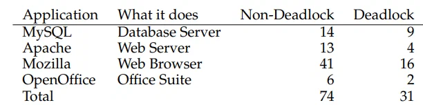
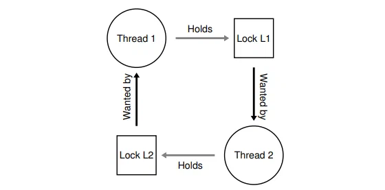

# Ostep глава 32. Common Concurrency Problems

Исследователи потратили много времени и сил разбираясь с багами конкурентного программирования. Написано много работ 
посвящённых **дэдлоку**, теме освещенной ранее, но в которую мы погрузимся глубже. [С+71] Последние работы были посвящены 
багам конкурентного программирования не связанным с дэдлоком. В этой главе мы быстро рассмотрим примеры багов конкурентного 
программирования обнаруженных в реальном коде, для того чтобы лучше понять то какие именно проблемы нужно искать в коде. 
И теперь наша центральная тема этой главы:

> Центральная тема: что делать с распространёнными багами конкурентного программирования? 
> Ошибки параллелизма, как правило, проявляются в различных распространенных шаблонах. Знание того, на какие из них 
> следует обратить внимание - это первый шаг к написанию более гибкого и корректного параллельного кода.

## 32.1 Какие типы багов существуют?

Наиболее очевидный вопрос следующий: какие основные типы багов есть в конкурентных программах. На вопрос трудно ответить 
в общем, но к счастью кто-то уже сделал часть работы за нас. Конкретно мы будем опираться на исследование Lu et al [L+08] 
которое очень детально анализирует некоторое количество конкурентных программ чтобы понять то какие баги возникают в них 
на практике.

Исследование фокусируется на 4 основных важных open source проектах: MySQL (популярная система управления базами данных), 
Apache (хорошо известный веб сервер), Mozilla (знаменитый веб браузер) и Open Office (бесплатная версия MS Office). 
В исследовании авторы инспектируют баги конкурентного программирования которые были найдены и исправлены в каждой из этих 
кодовых баз, превращая работу разработчиков в количественный анализ ошибок; понимание результатов исследования поможет вам 
понять типы проблем возникающих во взрослых кодовых базах.

Рисунок 32.1 показывает краткое описание ошибок, которые изучили Лу и его коллеги. Из рисунка можно увидеть что всего было 105 багов, большинство из которых были не связаны с дэдлоком (74); оставшиеся 31 возникли из за дэдлока. Далее вы можете увидеть количество багов изученых в каждом из приложений; в то время как open office содержит 8 багов связанных с параллелизмом, mozilla имеет около 60.

Теперь мы погрузимся в разные типы багов (возникших из за дэдлока и по причинам не связанным с дэдлоком) немного глубже. Для первого класса не-дэдлок багов, мы используем примеры из курса для оживления нашей дискуссии. Для второго класса дэдлок багов мы обсудим долгую работу проделанную в попытке избежать, исправить и контролировать дэдлок.

## 32.2 Не дэдлок баги

Исходя из исследования Lu - Баги этого класса составляют основную массу багов конкурентного программирования. Но что это за баги? Как они возникли? Как мы можем их исправить? Теперь обсудим два основных типа багов этого класса из исследования: **atomicity violation** и **order violation.**

### Atomicity Violation

Первый тип возникшей проблемы называется **atomicity violation**. Вот простой пример найденный в MySQL. Перед чтением объяснения попробуйте понять какие проблемы он вызывает. Сделайте это!

    1 Thread 1::
    2 if (thd->proc_info) {
    3   fputs(thd->proc_info, ...);
    4 }
    5
    6 Thread 2::
    7 thd->proc_info = NULL;

Рисунок 32.2 - Нарушение атомарности (atomicity.c)

В примере два потока пытаются получить доступ к полю proc_info в структуре thd. Первый поток проверяет значение на не null и печатает его значение. Второй поток устанавливает значение в null. Очевидно, что если первый поток произведёт удачную проверку и прервётся до вызова fputs, второй поток может выполниться по середине таким образом устанавливая значение поля в null; когда первый поток возобновит выполнение он завершится с ошибкой тк null pointer будет адресован в fputs.

Более формальное определение atomicity violation согласно исследованию Lu et al, следующее - "Нарушение желаемой сериализуемости при множественных обращениях к памяти (т.е. область должна быть атомарной но атомарность не соблюдается во время выполнения)." В примере выше в коде предполагается атомарность (по словам самого Lu) в месте проверки на null поля proc_info и использовании proc_info в вызове fputs; если предположение неверно - код не будет работать ожидаемым образом.

Найти решение для проблемы такого типа обычно (но не всегда) просто. Можете ли вы предложить решение описанной проблемы?

В решении (рис 32.3) мы просто добавляем блокировку вокруг вызова общей переменной, удостоверяясь в том что когда какой-либо поток получает доступ к полю proc_info, поле заблокировано (proc_info_lock). Конечно любой другой код получающий доступ к переменной должен также захватить блокировку.

        1 pthread_mutex_t proc_info_lock = PTHREAD_MUTEX_INITIALIZER;
        2 
        3 Thread 1::
        4 pthread_mutex_lock(&proc_info_lock);
        5 if (thd->proc_info) {
        6   fputs(thd->proc_info, ...);
        7 }
        8 pthread_mutex_unlock(&proc_info_lock);
        9 
       10 Thread 2::
       11 pthread_mutex_lock(&proc_info_lock);
       12 thd->proc_info = NULL;
       13 pthread_mutex_unlock(&proc_info_lock);

Рис 32.3 - Исправленная Atomicity Violation (atomicity_fixed.c)

### Баги Order-Violation

Другой тип не дэдлок багов найденых Lu известны как **order violation**. Вот другой простой пример; снова взгляните и попытайтесь разобраться почему код имеет баг.

    1 Thread 1::
    2 void init() {
    3   mThread = PR_CreateThread(mMain, ...);
    4 }
    5 
    6 Thread 2::
    7 void mMain() {
    8   mState = mThread->State;
    9 }

Рис 32.4 - Ordering Bug (ordering.c)

Как вы возможно поняли, код второго потока полагает что переменная mThread инициализирована и не равна null; тем не менее, если поток 2 запустится сразу после создания, значение mThread не будет инициализировано в момент вызова mMain потоком 2 и программа упадёт из-за перенаправления на null pointer . Обратите внимание что мы предполагаем что значение mThread изначально равно null; если это не так то разные странные вещи могут произойти в момент доступа к ram потоком 2 т.к. он будет ссылаться на непустую память.

        1 pthread_mutex_t mtLock = PTHREAD_MUTEX_INITIALIZER;
        2 pthread_cond_t mtCond = PTHREAD_COND_INITIALIZER;
        3 int mtInit = 0;
        4 
        5 Thread 1::
        6 void init() {
        7   ...
        8   mThread = PR_CreateThread(mMain, ...);
        9
       10   // signal that the thread has been created...
       11   pthread_mutex_lock(&mtLock);
       12   mtInit = 1;
       13   pthread_cond_signal(&mtCond);
       14   pthread_mutex_unlock(&mtLock);
       15   ...
       16 }
       17 
       18 Thread 2::
       19 void mMain(...) {
       20    ...
       21    // wait for the thread to be initialized...
       22   pthread_mutex_lock(&mtLock);
       23   while (mtInit == 0)
       24       pthread_cond_wait(&mtCond, &mtLock);
       25   pthread_mutex_unlock(&mtLock);
       26   
       27   mState = mThread->State;
       28   ...
       29 }

Рисунок 32.5: Fixing The Ordering Violation (ordering fixed.c)

Более формальное определение order violation: "Желаемый порядок выполнения между двумя группами доступа к памяти нарушен (А должно всегда выполняться до В но во время выполнения порядок не соблюдается)"

Решение этой проблемы в соблюдении порядка выполнения. Как было описано ранее, использование переменных-условия является простым и надёжным способом обеспечения порядка выполнения в современных кодовых базах. Мы можем переписать пример выше с помощью предложенной техники. Результат на рисунке 32.5

В этой исправленной версии мы использовали **переменную условия** mtCond и блокировку mtLock так же как переменную состояния mtInit. Когда инициализирующий код запускается, он присваивает переменной mtInit значение 1 и сигнализирует о завершении создания потока 1. Если поток 2 запустится, то будет ожидать сигнала об инициализации потока 1.

### Не дэдлок баги, выводы

Большая доля багов изученных Lu (97%) состояла из atomicity violation и order violation. Таким образом, держа в голове информацию о багах такого типа, программисты могут избежать ошибок связанных с ними. Более того, инструменты статического анализа кода должны сосредоточиться на анализе подобного рода багов, чтобы избегать основной массы ошибок.

К сожалению не все баги можно исправить так легко как мы видели в примерах выше. Некоторые требуют большего понимания о том, что именно делает программа, или большого рефакторинга сложных структур данных или больших объёмов кода. Почитайте отличное исследование Lu для большей информации.

## 32.3 Дэдлок баги

Помимо багов описанных выше, другой классической проблемой систем с конкурентным доступом, параллельным выполнением и сложными протоколами блокировки является дэдлок. Дэдлок возникает, например, в тот момент когда поток 1 удерживает блокировку L1 и ожидает блокировку L2 в тоже время второй поток удерживающий блокировку L2 ожидает пока разблокируется блокировка L1. Ниже есть рисунок демонстрирующий такое поведение.

")

Обратите внимание на то что если этот код запустить - он не обязательно вызовет дэдлок. Он может вызвать дэдлок в случае если поток 1 захватит блокировку L1, контекст переключится и поток 2 захватит блокировку L2 и попробует получить блокировку L1. Таким образом мы получим дэдлок когда потоки ожидают друг друга и никто не может продолжить выполнение. Смотрите рисунок 32.7 для графического отображения. Рисунок цикла отображает дэдлок.

Рисунок должен сделать проблему более понятной. Как программист должен писать код для избежания проблемы дэдлока?

> Проблемка: Что делать с дэдлоком? 
> Как мы должны проектировать системы чтобы избегать или исправлять/замечать дедлоки. Реальная ли это проблема в системах сегодня?

### Почему возникают дедлоки?

Как вам возможно показалось, простые дедлоки как один из описанных выше легко предотвратить. Например если потоки 1 и 2 будут всегда забирать блокировку в одном и том же строгом порядке, дедлок никогда не возникнет. Так почему же дедлоки возникают?

Одна из причин это то что в больших системах возникают сложные зависимости между компонентами. Рассмотрим, например, операционную систему. Системе виртуальной памяти может потребоваться доступ к файловой системе для отображения блока памяти с диска; впоследствии файловой системе может потребоваться доступ к виртуальной памяти для считывания блока и записи на диск. Таким образом проектирование стратегии блокировок в больших системах должно быть выполнено аккуратно чтобы избежать дедлоков из-за циклических зависимостей которые возникают в больших системах естественным образом.

Другая причина лежит в природе инкапсуляции. Как разработчики ПО мы можем скрывать детали реализаций и таким образом упрощать сборку программного обеспечения модульным способом. К сожалению такая модульность плохо согласуется с блокировками. Как отмечают исследователи, [J+08] некоторые, казалось бы безобидные интерфейсы почти вынуждают вас сделать дедлок. Например возьмите класс Java Vector и его метод AddAll(). Этот метод будет вызван следующим образом:

    Vector v1, v2;
    v1.AddAll(v2);

Под капотом, т.к. метод должен быть мультипотокобезопасным, нужны блокировки для вектора v1 и параметра v2. Процедура получает указанные блокировки в некотором произвольном порядке (скажем, v1, затем v2), чтобы добавить содержимое v2 в v1. Если какой-то другой поток вызовeт v2.addAll(v1), почти в тоже время, у нас потенциал для дедлока и все это таким образом, который совершенно скрыт от вызывающего приложения.

### Условия для дедлока

4 Условия которые должны совпасть для возникновения дедлока [С+71]

* Взаимное исключение. Потоки претендуют на исключительный контроль над ресурсами, которые им требуются (например, поток захватывает блокировку).
* Удержание и ожидание. Потоки удерживают выделенные им ресурсы (блокировки которые они уже выделили) пока ожидают дополнительных ресурсов (блокировки которые они хотят забрать).
* Отсутствие освобождения ресурсов. Ресурсы захваченные блокировкой не могут быть принудительно освобождены
* Циклическое освобождение. Существует циклическая цепочка потоков, такая, что каждый поток содержит один или несколько ресурсов (например, блокировок), которые запрашиваются следующим потоком в цепочке.

Если какое-либо из этих четырех условий не выполнено, дедлок не может возникнуть. Таким образом, сначала мы исследуем методы предотвращения взаимоблокировки; каждая из этих стратегий направлена на предотвращение возникновения одного из вышеуказанных условий и, таким образом, является одним из подходов к решению проблемы взаимоблокировки.

### Профилактика
#### Circular Wait

Вероятно, наиболее практичный (и, безусловно, часто используемый) метод предотвращения заключается в написании кода блокировки таким образом, чтобы вы никогда не вызывали циклическое ожидание. Самый простой способ сделать это - обеспечить **полный порядок (total ordering)** при получении блокировки. Например, если в системе есть только две блокировки (L1 и L2), вы можете предотвратить взаимоблокировку, всегда получая L1 перед L2. Такой строгий порядок гарантирует, что не возникает циклического ожидания; следовательно, нет взаимоблокировки.

Конечно, в более сложных системах будет существовать более двух блокировок, и, таким образом, полного упорядочения блокировок может быть трудно достичь (и, возможно, нет необходимости). Таким образом, **частичный порядок (partial ordering)** может быть полезным способом структурировать получение блокировки таким образом, чтобы избежать взаимоблокировки. Отличный реальный пример частичного упорядочения блокировок можно увидеть в коде отображения памяти в Linux [T+94] (v5.2); комментарий в верхней части исходного кода раскрывает десять различных групп заказов на получение блокировки, включая простые, такие как “i_mutex **before** i_mmap_rwsem” и более сложные заказы, такие как “i_mmap_rwsem **before** private_lock before swap_lock **before** i_pages_lock”.

> СОВЕТ: ПРИНУДИТЕЛЬНО УСТАНОВИТЬ ПОРЯДОК БЛОКИРОВКИ ПО АДРЕСУ БЛОКИРОВКИ
> 
> В некоторых случаях функция должна перехватывать две (или более) блокировки; таким образом, мы знаем, что должны быть осторожны, иначе может возникнуть взаимоблокировка. Представьте себе функцию, которая вызывается следующим образом: функция do_something(mutex t *m1, mutex t *m2). Если код всегда захватывает m1 перед m2 (или всегда m2 перед m1), это может привести к взаимоблокировке, потому что один поток может вызвать do_something(L1, L2), в то время как другой поток может вызвать do_something(L2, L1).
> 
> Чтобы избежать этой конкретной проблемы, умный программист может использовать адрес каждой блокировки как способ упорядочить получение блокировки. Получая блокировки либо в порядке следования адресов от высокого к низкому, либо от низкого к высокому, do_something() может гарантировать, что он всегда получает блокировки в одном и том же порядке, независимо от того, в каком порядке они передаются. Код выглядел бы примерно так:

    if (m1 > m2) { //Захват в порядке от большего к меньшему
        pthread_mutex_lock(m1);
        pthread_mutex_lock(m2);
    } else {
        pthread_mutex_lock(m2);
        pthread_mutex_lock(m1);
    }
    // Код предполагает что m1 != m2 (не одна и таже блокировка)

> Используя этот простой метод, программист может обеспечить простую и эффективную реализацию сбора данных с несколькими блокировками без взаимоблокировок.

Как вы уже поняли, как полное, так и частичное упорядочивание требуют тщательной разработки стратегий блокировки и должны быть сконструированы с большой осторожностью. Кроме того, упорядочивание - это всего лишь соглашение, и неаккуратный программист может легко проигнорировать протокол блокировки и потенциально вызвать взаимоблокировку. Наконец, порядок блокировок требует глубокого понимания базы кода и того, как вызываются различные подпрограммы; всего одна ошибка может привести к появлению слова на букву "Д" (Дэдлок).

#### Hold-and-wait

Требования hold-and-wait для взаимоблокировки можно избежать, захватив все блокировки сразу, атомарно. На практике этого можно было бы достичь следующим образом:

    1 pthread_mutex_lock(prevention); // begin acquisition
    2 pthread_mutex_lock(L1);
    3 pthread_mutex_lock(L2);
    4 ...
    5 pthread_mutex_unlock(prevention); // end

Сначала используя блокировку prevention, этот код гарантирует, что во время получения блокировки не произойдет несвоевременного переключения потоков и, таким образом, снова можно избежать взаимоблокировки. Конечно, это требует, чтобы каждый раз, когда какой-либо поток захватывает блокировку, он сначала получал глобальную блокировку prevention. Например, если бы другой поток пытался захватить блокировки L1 и L2 в другом порядке, это было бы допустимо, потому что при этом он удерживал бы блокировку prevention.

Обратите внимание, что это решение проблематично по ряду причин. Как и прежде, инкапсуляция работает против нас: при вызове подпрограммы этот подход требует, чтобы мы точно знали, какие блокировки должны удерживаться, и получали их заранее. Этот метод также, вероятно, уменьшит параллелизм, поскольку все блокировки должны быть получены на ранней стадии (сразу), а не тогда, когда они действительно необходимы.

#### Никакого вытеснения

Поскольку мы обычно рассматриваем блокировки как удерживаемые до тех пор, пока не будет вызвана разблокировка, получение нескольких блокировок часто приводит нас к проблемам, потому что в ожидании одной блокировки мы удерживаем другую. Многие библиотеки потоков предоставляют более гибкий набор интерфейсов, чтобы помочь избежать этой ситуации. В частности, подпрограмма pthread_mutex_trylock() либо захватывает блокировку (если она доступна) и возвращает успех, либо возвращает код ошибки, указывающий, что блокировка удерживается; в последнем случае вы можете повторить попытку позже, если хотите захватить эту блокировку.

Такой интерфейс можно было бы использовать следующим образом для построения протокола получения блокировок без взаимоблокировок и с высокой степенью упорядоченности:

    1 top:
    2   pthread_mutex_lock(L1);
    3   if (pthread_mutex_trylock(L2) != 0) {
    4       pthread_mutex_unlock(L1);
    5       goto top;
    6   }

Обратите внимание, что другой поток мог бы следовать тому же протоколу, но перехватывать блокировки в другом порядке (L2 затем L1), и программа по-прежнему была бы свободна от взаимоблокировки. Однако возникает одна новая проблема: livelock. Возможно (хотя и маловероятно), что два потока могли бы оба неоднократно пытаться выполнить код в этом порядке и неоднократно терпеть неудачу в получении обеих блокировок. В этом случае обе системы запускают эту последовательность кода снова и снова (и, таким образом дедлок не возникает), но прогресс не достигается, отсюда и название livelock. Существуют также решения проблемы **livelock**: например, можно было бы добавить случайную задержку перед повторным циклом и повторной попыткой всего процесса, тем самым уменьшая вероятность конфликта между конкурирующими потоками.

Один момент в этом решении: оно обходит сложные моменты использования подхода trylock. Первая проблема, которая, вероятно, возникнет снова, возникает из-за инкапсуляции: если одна из этих блокировок скрыта в какой-либо вызываемой подпрограмме, возврат к началу становится более сложным для реализации. Если код захватил какие-то ресурсы (отличные от L1) по пути, он должен убедиться, что они также были тщательно освобождены; например, если после получения L1 код выделил некоторую память, ему пришлось бы освободить эту память при неудачной попытке захватить L2, прежде чем выполнить код снова. Однако в ограниченных обстоятельствах (например, метод Java vector, упомянутый ранее) этот подход может хорошо работать.

Вы также можете заметить, что этот подход на самом деле не добавляет упреждение (принудительное действие по снятию блокировки с потока, которому она принадлежит), а скорее использует подход trylock, позволяющий разработчику изящно отказаться от владения блокировкой (т.е. исключить свое собственное владение). Однако это практический подход, и поэтому мы включаем его здесь, несмотря на его несовершенство в этом отношении.

#### Mutual Exclusion

Окончательный метод предотвращения состоял бы в том, чтобы вообще избежать необходимости взаимного исключения. В общем, мы знаем, что это сложно, потому что код, который мы хотим запустить, действительно содержит критические разделы. Итак, что мы можем сделать?

У Херлихи была идея, что можно проектировать различные структуры данных вообще без блокировок [H91, H93]. Идея, лежащая в основе **lock-free** структур (и связанных с ними **wait-free** подходов), проста: используя мощные аппаратные инструкции, вы можете создавать структуры данных способом, не требующим явной блокировки.

В качестве простого примера давайте предположим, что у нас есть инструкция compare-and-swap, которая, как вы, возможно, помните, является атомарной инструкцией, предоставляемой аппаратным обеспечением, которое выполняет следующее:

    1 int CompareAndSwap(int *address, int expected, int new) {
    2   if (*address == expected) {
    3       *address = new;
    4       return 1; //успех
    5   }
    6   return 0; // неудача
    7 }

Представьте, что теперь мы хотим атомарно увеличить значение на определенную величину, используя compare-and-swap. Мы могли бы сделать это с помощью следующей простой функции:

    1 void AtomicIncrement(int *value, int amount) {
    2   do {
    3       int old = *value;
    4   } while (CompareAndSwap(value, old, old + amount) == 0);
    5 }

Вместо того, чтобы захватывать блокировку, выполнять обновление, а затем освобождать ее, мы вместо этого создали подход, который неоднократно пытается обновить значение до новой суммы и использует для этого compare-and-swap. Таким образом, блокировка не захватывается и дедлок возникнуть не может (livelock все еще возможен, и, следовательно, надежное решение будет более сложным, чем простой фрагмент кода выше).

Давайте рассмотрим немного более сложный пример: вставка списка. Вот код, который вставляет в начало списка:

    1 void insert (int value) {
    2   node_t *n = malloc(sizeof(node_t));
    3   assert(n != NULL);
    4   n->value = value;
    5   n->next = head;
    6   head = n;
    7 }

Этот код выполняет простую вставку, но при одновременном вызове несколькими потоками возникает race condition. Можете ли вы понять, почему? (нарисуйте картину того, что может произойти со списком, если будут выполнены две одновременные вставки, предполагая, как всегда, злонамеренное чередование по расписанию). Конечно, мы могли бы избежать проблем окружив код захватом и освобождением блокировки:

    1 void insert (int value) {
    2   node_t *n = malloc(sizeof(node_t));
    3   assert(n != NULL);
    4   n->value = value;
    5   pthread_mutex_lock(listlock); // начало критической секции
    6   n->next = head;
    7   head = n;
    8   pthread_mutex_unlock(listlock); // конец критической секции
    9 }

В этом решении мы используем блокировки традиционным способом*. Вместо этого давайте попробуем выполнить эту вставку без блокировки, просто используя инструкцию compare_and_swap(). Вот один из возможных подходов:

    1 void insert (int value) {
    2   node_t *n = malloc(sizeof(node_t));
    3   assert(n != NULL);
    4   n->value = value;
    5   do {
    6       n->next = head;
    7   } while (CompareAndSwap(&head, n->next, n) == 0);
    8 }

> *Проницательный читатель может спросить, почему мы перехватили блокировку так поздно, вместо того, чтобы сделать это сразу при входе в insert(); можете ли вы, проницательный читатель, выяснить, почему это, скорее всего, правильно? Какие предположения делает код, например, относительно вызова malloc()?

Приведенный здесь код обновляет следующий указатель, чтобы он указывал на текущий головной элемент, а затем пытается переместить вновь созданный узел в положение нового головного элемента списка. Однако это завершится неудачей, если какой-либо другой поток тем временем успешно заменит головной элемент, в результате чего этот поток повторит попытку с новым головным элементом.

Конечно, создание полезного списка требует больше, чем простая вставка в список, и неудивительно, что создание списка, в который вы можете вставлять, удалять из него и выполнять поиск без блокировки, является нетривиальной задачей. Ознакомьтесь с обширной литературой по lock-free и wait-free синхронизации, чтобы узнать больше [H01, H91, H93].

#### Предотвращение дедлок с помощью scheduling

Вместо борьбы с дедлоком в некоторых сценариях предпочтительнее предотвратить дедлок. Для предотвращения требуется некоторое глобальное знание того, какие блокировки могут быть захвачены различными потоками во время их выполнения, и последующее планирование указанных потоков таким образом, чтобы гарантировать отсутствие дедлока.

Например, предположим, что у нас есть два процессора и четыре потока, которые должны быть запланированы на них. Предположим далее, что мы знаем, что поток 1 (T1) захватывает блокировки L1 и L2 (в некотором порядке, в какой-то момент во время своего выполнения), T2 также захватывает L1 и L2, T3 захватывает только L2, а T4 вообще не захватывает блокировок. Мы можем показать эти требования потоков к получению блокировок в табличной форме:

Таким образом, умный планировщик мог бы вычислить, что до тех пор, пока T1 и T2 не выполняются одновременно, взаимоблокировка никогда не возникнет. Вот одно из таких расписаний:

Обратите внимание, что это нормально, если (T3 и T1) или (T3 и T2) перекрываются. Даже при том, что T3 захватывает блокировку L2, он никогда не может вызвать взаимоблокировку, выполняясь одновременно с другими потоками, потому что он захватывает только одну блокировку.

Давайте рассмотрим еще один пример. В этом случае существует больше конфликтов за одни и те же ресурсы (опять же, блокировки L1 и L2), как указано в следующей таблице конфликтов:

> СОВЕТ: НЕ ВСЕГДА ДЕЛАЙТЕ ИДЕАЛЬНО (ЗАКОН ТОМА УЭСТА)
> Том Уэст, известный как автор классической книги компьютерной индустрии “Душа новой машины" [K81], как известно, говорит: "Не все, что стоит делать, стоит делать хорошо”, что является потрясающей инженерной максимой. Если что-то плохое случается редко, конечно, не следует тратить много усилий на то, чтобы предотвратить это, особенно если цена возникновения чего-то плохого невелика. Если, с другой стороны, вы строите космический челнок, и цена того, что что-то пойдет не так, - это взрыв космического челнока, что ж, возможно, вам следует проигнорировать этот совет.
> Некоторые читатели возражают: “Это звучит так, как будто вы предлагаете посредственность в качестве решения!” Возможно, они правы в том, что нам следует быть осторожными с подобными советами. Однако наш опыт подсказывает нам, что в мире инжиниринга, с учетом сжатых сроков и других реальных проблем, всегда приходится решать, какие аспекты системы следует хорошо отстроить, а какие отложить на другой день. Самое сложное - это знать, что и когда делать, а немного понимания можно получить только благодаря опыту и преданности поставленной задаче.

В частности, всем потокам T1, T2 и T3 необходимо захватить обе блокировки L1 и L2 в какой-то момент во время их выполнения. Вот возможный график, который гарантирует, что дедлок никогда не возникнет:

[32.91.webp](./img/32.91.webp)

Как вы можете видеть, статическое планирование приводит к консервативному подходу, при котором T1, T2 и T3 выполняются на одном процессоре, и, таким образом, общее время выполнения заданий значительно увеличивается. Хотя, возможно, было возможно выполнять эти задачи одновременно, страх перед взаимоблокировкой мешает нам сделать это, а стоимость - это производительность.

Одним из известных примеров подобного подхода является "Aлгоритм банкира" Дейкстры [D64], и в литературе описано много подобных подходов. К сожалению, они полезны только в очень ограниченных средах, например, во встроенной системе, где пользователь имеет полное представление обо всем наборе задач, которые необходимо выполнить, и о необходимых им блокировках. Кроме того, такие подходы могут ограничить параллелизм, как мы видели во втором примере выше. Таким образом, предотвращение взаимоблокировки с помощью планирования не является широко используемым решением общего назначения.

#### Detect and recover

Одна финальная основная стратегия заключается в том, чтобы допускать дедлоки а затем принимать меры по устранению причин их возникновения. Например если ОС зависает 1 раз в год, то вы просто перезагрузите её и будете дальше счастливо работать (возможно немного поворчите перед этим). Если дедлоки редкие, то никакого решения скорее всего не требуется. Многие системы баз данных используют эту стратегию. Детектор дедлоков периодически запускается, строит граф ресурсов и циклически проверяет его. При обнаружении дедлока в цикле, система должна быть перегазгружена. Если требуется сложное восстановление структур данных, для облегчения процесса может быть привлечен человек.

Более подробную информацию о параллелизме базы данных, дедлоках и связанных с этим проблемах можно найти в другом месте [B+87, K87]. Прочитайте эти работы, а еще лучше, пройдите курс по базам данных, чтобы узнать больше об этой богатой и интересной теме.

## 32.4 Выводы

В этой главе мы изучили типы ошибок, которые возникают в программах в которых применялось параллельное программирование. Первый тип, ошибки, не связанные с дедлоком, на удивление распространены, но часто их легче исправить. Они включают нарушения атомарности, при которых последовательность инструкций, которые должны были выполняться вместе, не была выполнена, и нарушения порядка, при которых необходимый порядок между двумя потоками не был соблюден.

Мы также кратко обсудили дедлоки: почему они возникают и что с этим можно сделать. Проблема так же стара, как и сам параллелизм, и на эту тему было написано много сотен статей. Лучшее решение на практике - быть осторожным, разработать порядок получения блокировки и, таким образом, предотвратить явные причины возникновения взаимоблокировки. wait-free подходы, также многообещающи, поскольку некоторые wait-free структуры данных находят своё применение в популярных библиотеках и системах, включая Linux. Однако их недостаточная универсальность и сложность разработки новой wait-free структуры данных, вероятно, ограничат общую полезность этого подхода. Возможно, лучшим решением является разработка новых моделей параллельного программирования: в таких системах, как MapReduce (от Google) [GD02], программисты могут описывать определенные типы параллельных вычислений без каких-либо блокировок вообще. Блокировки проблематичны по самой своей природе; возможно, нам следует стремиться избегать их использования, если в этом действительно нет необходимости.

## Ссылки

[B+87] “Concurrency Control and Recovery in Database Systems” by Philip A. Bernstein, Vassos Hadzilacos, Nathan Goodman. Addison-Wesley, 1987. Классический текст о параллелизме в системах управления базами данных. Как вы можете видеть, понимание параллелизма, взаимоблокировок и других тем в мире баз данных - это целый мир сам по себе. Изучите это и убедитесь в этом сами.

[C+71] “System Deadlocks” by E.G. Coffman, M.J. Elphick, A. Shoshani. ACM Computing Surveys, 3:2, June 1971. Классический документ, описывающий условия возникновения дедлока и то, как вы могли бы с ним справиться. Безусловно, есть несколько более ранних работ на эту тему; подробнее см. ссылки в этой статье.

[D64] “Een algorithme ter voorkoming van de dodelijke omarming” by Edsger Dijkstra. 1964. Available: http://www.cs.utexas.edu/users/EWD/ewd01xx/EWD108.PDF. Действительно, Дейкстра не только предложил ряд решений проблемы дедлока, он был первым, кто отметил ее существование, по крайней мере, в письменной форме. Однако он назвал это “смертельными объятиями”, которые (к счастью) не прижились.

[GD02] “MapReduce: Simplified Data Processing on Large Clusters” by Sanjay Ghemawhat, Jeff Dean. OSDI ’04, San Francisco, CA, October 2004. Статья MapReduce открыла эру крупномасштабной обработки данных и предлагает структуру для выполнения таких вычислений на кластерах, как правило, ненадежных машин.

[H01] “A Pragmatic Implementation of Non-blocking Linked-lists” by Tim Harris. International Conference on Distributed Computing (DISC), 2001. Относительно современный пример трудностей создания чего-то столь простого, как параллельный связанный список без блокировок.

[H91] “Wait-free Synchronization” by Maurice Herlihy . ACM TOPLAS, 13:1, January 1991. Работа Херлихи является пионером идей, лежащих в основе подходов без ожидания к написанию параллельных программ. Эти подходы, как правило, сложны и труднодоступны, часто более сложны, чем правильное использование блокировок, что, вероятно, ограничивает их успех в реальном мире.

[H93] “A Methodology for Implementing Highly Concurrent Data Objects” by Maurice Herlihy. ACM TOPLAS, 15:5, November 1993. Хороший обзор структур, не требующих блокировки и ожидания. Оба подхода избегают блокировок, но подходы без ожидания сложнее реализовать, поскольку они пытаются гарантировать, что любая операция над параллельной структурой завершится за конечное число шагов (например, без неограниченного цикла).

[J+08] “Deadlock Immunity: Enabling Systems To Defend Against Deadlocks” by Horatiu Jula, Daniel Tralamazza, Cristian Zamfir, George Candea. OSDI ’08, San Diego, CA, December 2008. Отличная недавняя статья о взаимоблокировках и о том, как избежать попадания в одни и те же ситуации снова и снова в конкретной системе.

[K81] “Soul of a New Machine” by Tracy Kidder. Backbay Books, 2000 (reprint of 1980 version). Обязательное к прочтению для любого разработчика систем или инженера, в нем подробно рассказывается о первых днях работы команды Data General (DG) во главе с Томом Уэстом над созданием “новой машины”. Другие книги Киддера также превосходны, в том числе “Горы за горами”. Или, может быть, вы с нами не согласны, запятая?

[K87] “Deadlock Detection in Distributed Databases” by Edgar Knapp. ACM Computing Surveys, 19:4, December 1987. Отличный обзор обнаружения взаимоблокировок в распределенных системах баз данных. Также указывает на ряд других смежных работ и, таким образом, является хорошим местом для начала вашего чтения.

[L+08] “Learning from Mistakes — Всестороннее исследование характеристик ошибок параллелизма в реальном мире” Шан Лу, Соен Пак, Ынсу Со, Юаньюань Чжоу. ASPLOS ’08, март 2008, Сиэтл, Вашингтон. Первое углубленное исследование ошибок параллелизма в реальном программном обеспечении и основа для этой главы. Посмотрите на веб-страницы Ю.Ю. Чжоу или Шань Лу, чтобы найти еще много интересных статей об ошибках.

[T+94] “Linux File Memory Map Code” by Linus Torvalds and many others. Available online at: http://lxr.free-electrons.com/source/mm/filemap.c. Спасибо Майклу Уолфишу (Нью-Йоркский университет) за указание на этот ценный пример. Реальный мир, как вы можете видеть в этом файле, может быть немного сложнее, чем простая ясность, которую можно найти в учебниках...
